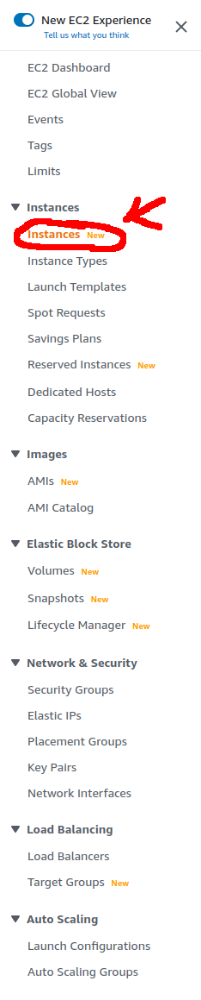

# AWS Server Creation Guide
This guide explains how to create an AWS EC2 machine that is (1) sufficiently
powerful to use or do dev work and (2) publicly accessible for other CSGO clients to connect to.

If you are going to dev work on an AWS machine, I recommend using CLion's remote
mode: https://www.jetbrains.com/help/clion/remote-projects-support.html#remote-toolchain
to have an IDE on your local machine while running the code on an AWS machine.

## Instructions
1. Create an [AWS account](https://aws.amazon.com/). You will need to attach a credit card.
2. Go to the AWS Management Console. This can be done by clicking on the **My
   Account** dropdown on the AWS homepage, and then on **AWS Management
   Console** link in that dropown.
   
3. Go to the **EC2** management area in the management console. This can be done by typing
   **EC2** in the search bar at the top of the page.
   
4. Create the **Security Group** for the EC2 machine. This will open the ports
   on the machine.
   1. Go to the **Security Groups** page in the **EC2** management area by
      clicking on the appropriate option on the left menu bar in the **EC2***
      management area.
      
   2. Create a **Security Group** with the following ports. Note that the below
      image has duplicate ports. ::/0 indicates that the server should accept
      connections from all IPv6 ip addresses on a specific port. 0.0.0.0/0
      indicates that the server should accpet connections from all IPv4 ip
      addresses on a specific port. I'm not sure if you need both, but I put both
      to be save.
      
   3. Pick a memorable name for the **Security Group**, like **CSGO Group**
5. Create the **EC2 Instance** (aka the server)
   1. Go to the **EC2 Dashboard** page in the **EC2** management area by
   clicking on the appropriate option on the left menu bar in the **EC2**
   management area.
      
   2. Start the **Launch instance** wizard.
      
   2. Pick a memorable name for the machine, like **CSGO Server**.
   3. Set the OS image to **Ubuntu 22.04** and the instance type to
      **m6i.large**. (**Note:** you may be able to use a cheaper instance, but
      I've had good stability at a reasonable price with the m6i.large
      instances.) 
      
   4. If this is your first AWS server, create a **Key Pair**. Make sure to
      download the appropriate **.pem** or **.ppk** file. 
      1. If your local OS is Linux, you should download a **.pem** file. Here's
         a [guide](https://stackoverflow.com/questions/34045375/connect-over-ssh-using-a-pem-file)
         on how to use it to connect to a server.
      2. If your local OS is Windows, you should download a **.ppk** file.
         Here's a [guide](https://docs.aws.amazon.com/AWSEC2/latest/UserGuide/putty.html#putty-ssh) 
         on how to use it to connect to a server.
      3. If this isn't your first AWS server, I hope you remember where you
         saved your **Key Pair** file. Otherwise, you'll need to make a new one.
   5. In the **Network Settings** part of the wizard, select the **Select
      existing security group** potion, then pick the **Security Group** you
      previously created, like **CSGO Group**.
   6. In the **Configure Storage** part of the wizard, create a 100GB gp2 root volume.
   7. Press launch instance on the middle-right part of the page.
6. Assign a static **Elastic IP** to the server
   1. Go to the **Elastic IPs** page in the **EC2** management area by clicking
      on the appropriate option on the left menu bar in the **EC2** management
      area.
      
   2. Click **Allocate Elastic IP address** in the top-right part of the page.
      Use all the standard options for this wizard.
   3. Back on the main **Elastic IP addresses** page, click on the new IP
      address, then click on the **Actions** button in the top-right part of the
      page. Use the **Associate Elastic IP address** button to associate this IP address with your server like **CSGO Server**
7. Verify that the **EC2 Instance** is running by going to the **Instances**
   page. You should see the server in the **Running** Instance state.
   
6. Connect to the server using ssh.
   1. [Here's a Linux guide.](https://stackoverflow.com/questions/34045375/connect-over-ssh-using-a-pem-file)
         on how to use it to connect to a server.
   2. [Here's a Windows guide](https://docs.aws.amazon.com/AWSEC2/latest/UserGuide/putty.html#putty-ssh) 
7. When you are finished with the server, use the **Instances** page and
   changing the **Instance state**. 
   1. **Stop** the server when you are finished but may want to restart it later.
   2. **Terminate** the server if you never want to restart it. Make sure to
      release the **Elastic IP** after terminating the server.
