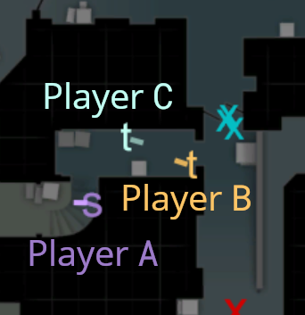

# Introduction
This document lists the current set of supported or in development queries for CSKnow as of 4-7-21.
For each query, this document lists:

1. Summary
2. English definition
3. In-Game Examples
4. Pseudocode definition

The pseudocode definitions assume knowledge of the schema specified in 
[schema.md](https://github.com/David-Durst/csknow/blob/master/theory/schema.md).

# Queries

## Wallers

### Summary
Situations where it appears that a player can see enemies through walls.

### English Definition
1. Player A can't see player B
2. Ray from A's crosshair intersects B's bounding box for two seconds

### In-Game Examples

The above is a video example of a waller. It shows the same situation as the 2D
visualization below. Player A (BOT Moe) is running through lower tunnels of 
the de_dust2 map and staring at player B (BOT Vitaly) through the wall.

### Pseudocode Definition
1. For every `demoTickNumber` `j` and in each `demoFile` `d`
2. For all pairs of players `(A,B)` such that `!TEAMMATES(A,B)`
   1. `TEAMMATES(A,B)` is computed using the `team` field of the `playerPosition` table.
3. If for all j such that `j < k < j+TWO_SECONDS` . `STARING_AT(A,B,k)` and 
   `MOST_RECENT_ENTRY(spotted,A,B,k)` 
   1. `STARING_AT(A,B,K)` - computed from `playerPosition` table by taking row with
    `demoFile` `d` and `demoTickNumber` `k` and determining if ray from `(xViewDirection, yViewDirection)`
    for `playerNumber` `A` interesects bounding box determined by `xPosition`,
    `yPosition`, and `zPosition` for `playerNumber` `B` and the dimensions of a player model.
   2. `MOST_RECENT_ENTRY(spotted,A,B,k)` - the `spotted` table contains an entry every time
    `spottedPlayer` `B` becomes visibile or stops being visible to an opponent `A`.
    `A` is stored as `spotterName` in `possibleSpotters`. This condition checks
    whether the most recent entry in `spotted` is true or false. If no entry,
    false is assumed since enemies start each round without being able to see each other.
4. Then `WALLER(A,B,j)`

## Baiters

### Summary
Situations where players could help their teammates by moving to their position,
but instead hide and let their teammates die.

### English Definition
1. Player A is not visible to player B
2. B kills player C
3. A  could've started running to C's position and reached it in two seconds before kill

### In-Game Examples

The above is a video example of a baiter. It shows the same situation as the 2D
visualization below. Player A (BOT Rock) is hiding in tunnel's stairs of the de_dust2 map.
Player A is hiding from from player B (BOT Moe) instead of helping his teammate player C (BOT Brett).
B kills player C.

### Pseudocode Definition
1. For every `demoTickNumber` `j` and in each `demoFile` `d`
2. For all triples of players `(A,B,C)` such that `TEAMMATES(A,C)` and `!TEAMMATES(A,B)`
3. If exists j such that `j-TWO_SECONDS < k < j` such that `DISTANCE(A,C,k) / MAX_SPEED < j-k`
    1. `DISTANCE(A,C,K)` - computed from `playerPosition` table by taking row with
       `demoFile` `d` and `demoTickNumber` `k` and positions determined by `xPosition`,
       `yPosition`, and `zPosition` for `playerNumber` `A` and `B`.
    2. `MAX_SPEED` - constant from the game. All players can reach this speed by 
       running with their knife as their active weapon. All players always have a knife.
4. Then `BAITER(A,B,C,j,k)`

