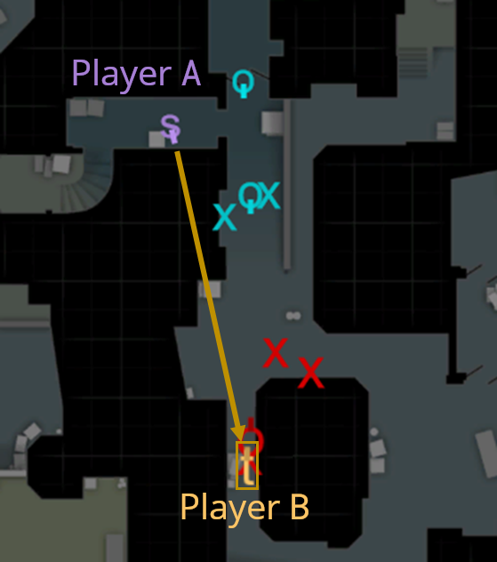

# Introduction
This document lists the current set of supported or in development queries for CSKnow as of 4-7-21.
For each query, this document lists:

1. Summary
2. English definition
3. In-Game Examples
4. Pseudocode definition

The pseudocode definitions assume knowledge of the schema specified in 
[schema.md](https://github.com/David-Durst/csknow/blob/master/theory/schema.md).

# Queries

## Waller

### Summary
Situations where it appears that players can see enemies through walls.

### English Definition
1. Game state specifies that player A can't see player B
2. Ray from A's crosshair intersects B's bounding box for two seconds

### In-Game Examples

The above is a video example of a waller. It shows the same situations as the 2D
visualization below. Player A (BOT Moe) is running through lower tunnels of 
the de_dust2 map and staring at player B (BOT Vitaly) through the wall.

