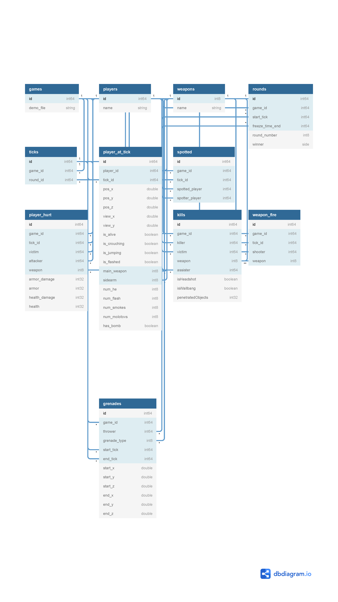

# CSKnow Schema
CSKnow's data is split into two parts: input tables used for query processing,
and events produced by the query processing.

In the below diagrams, the primary keys of each table are in bold.
Multiple bold keys means a composite primary key.

## Input Tables

The main input table is `player_at_tick`. This tracks the location of every player.
There is one row in `player_at_tick` for each player and time step (tick) in the demo file.
The primary key for each table is id.

## Event Tables

Each event occurs at a moment in time (demoTickNumber) and has a duration (ticksPerEvent).
Additionally, events may have different numbers of players involved.
I break the events into four categories depending on whether they have a single 
source player or multiple target players.
For the wallers query that identifies cheaters staring at other players
through a wall, the source is the cheater and the target is the person being stared at.

